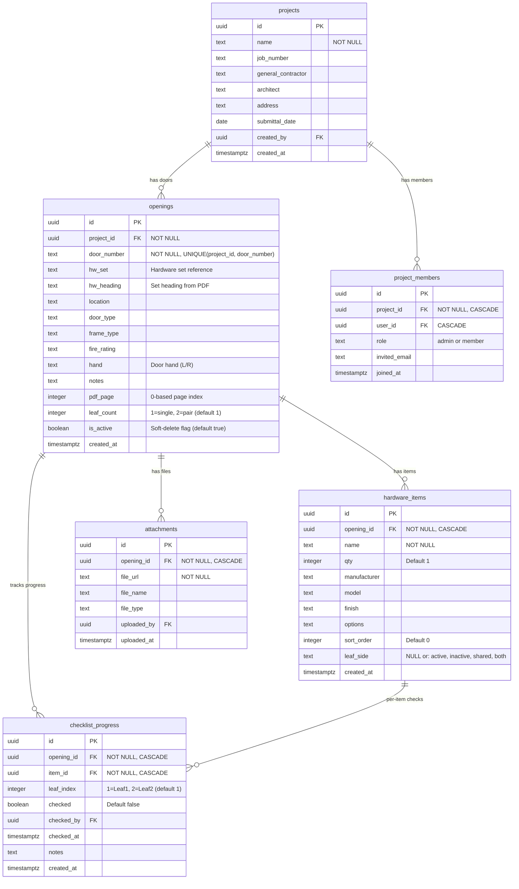
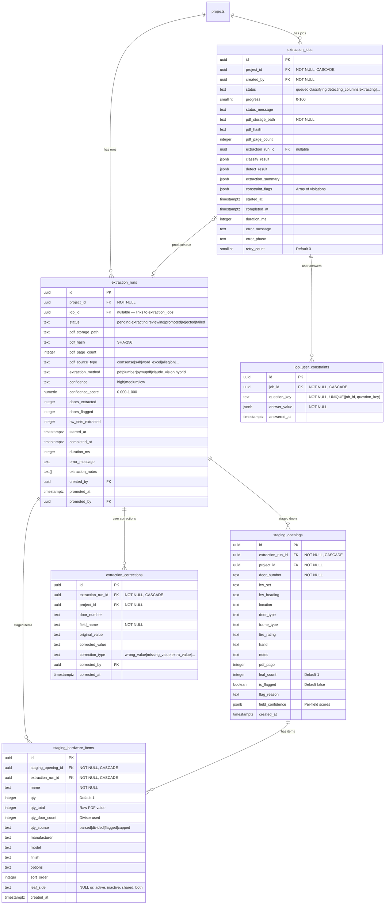
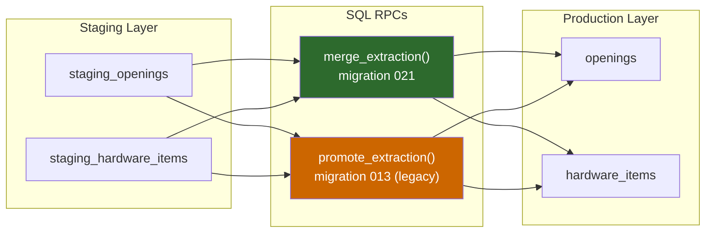

# Data Model

This document describes the Supabase/Postgres schema, showing table relationships, key columns, and which pipeline stages populate them.

## ER Diagram: Production Tables

These are the core tables that store reviewed, promoted data.

### Column Notes

**`openings.pdf_page`** — The 0-based page index where the hardware set heading was found during extraction. Populated by `findPageForSet()` in `src/lib/punch-cards.ts`. Used by the region rescan feature to show the correct PDF page.

**`openings.leaf_count`** — 1 for single doors, 2 for pair doors. Detected by `detectIsPair()` using three signals: heading-derived leaf count, opening size >= 48", and keyword scan. Populated at save time by `buildPerOpeningItems()`.

**`openings.is_active`** — Soft-delete flag introduced in migration 021. `merge_extraction()` sets `is_active=false` for doors that are no longer in the latest extraction (instead of hard-deleting them).

**`hardware_items.leaf_side`** — Per-item leaf attribution. Populated by `buildPerOpeningItems()` at save time via `computeLeafSide()`. Used by `groupItemsByLeaf()` at render time. See [Hinge Logic](./hinge-logic.md) for details on how electric hinges affect this value.

| leaf_side | Meaning | Example Items |
|-----------|---------|---------------|
| `'active'` | Active leaf only | Lockset, exit device, electric hinge |
| `'inactive'` | Inactive leaf only | Flush bolt |
| `'shared'` | Per-opening (not per-leaf) | Coordinator, threshold, astragal |
| `'both'` | Both leaves, separate rows | Standard hinges, closer |
| `NULL` | Unset — render-time fallback | Legacy data, batch job imports |

**`hardware_items.install_type`** — User-set field (not extracted from PDF). Not part of the normalization pipeline.

---

## ER Diagram: Staging & Extraction Tables

These tables hold pre-review extraction data and background job state.

### Staging-to-Production Flow

**`merge_extraction()`** (migration 021) — The recommended promotion path. Intelligently matches staging doors to existing production doors by `door_number`:
- **Unchanged doors:** Preserves checklist_progress and attachments
- **Changed hardware:** Replaces hardware_items (cascades checklist)
- **New doors:** Inserts as new openings
- **Removed doors:** Soft-deletes (`is_active = false`)

**`promote_extraction()`** (migration 013) — Legacy promotion. Hard-deletes ALL existing production openings for the project and replaces with staging data. Preserves `leaf_side` through promotion.

---

## Which Pipeline Stage Populates Which Columns

### hardware_items columns

| Column | Populated by | Notes |
|--------|-------------|-------|
| `name` | Python extract-tables.py or Claude vision | Raw item name from PDF |
| `qty` | `normalizeQuantities()` (TS) | Divided quantity per opening/leaf |
| `manufacturer` | Python or Claude | Extracted from PDF |
| `model` | Python or Claude | Extracted from PDF |
| `finish` | Python or Claude | Extracted from PDF |
| `options` | Python or Claude | Extracted from PDF |
| `sort_order` | Extraction order | Preserved from PDF table order |
| `leaf_side` | `buildPerOpeningItems()` via `computeLeafSide()` | **Only in wizard/revision paths — NULL in batch job path** |
| `install_type` | User (manual) | Not extracted from PDF |

### staging_hardware_items extra columns

| Column | Populated by | Notes |
|--------|-------------|-------|
| `qty_total` | Python `normalize_quantities()` | Raw PDF value before division |
| `qty_door_count` | Python `normalize_quantities()` | The divisor (leaf_count or door_count) |
| `qty_source` | Python → TS pipeline | Tracks how qty was calculated |

### openings columns

| Column | Populated by | Notes |
|--------|-------------|-------|
| `door_number` | Python heading parser | Extracted from set headings |
| `hw_set` | Python heading parser | Hardware set reference (e.g., "DH1") |
| `hw_heading` | Python heading parser | Full heading text |
| `pdf_page` | `findPageForSet()` in `punch-cards.ts` | Page where set heading was found |
| `leaf_count` | `detectIsPair()` at save time | 1 or 2 |
| `door_type`, `frame_type` | Python or user | From PDF or manual entry |
| `is_active` | `merge_extraction()` | Soft-delete flag |

---

## Key SQL RPCs

### `write_staging_data(p_extraction_run_id, p_project_id, p_payload)`

Transactional bulk write of extraction results to staging tables. Used by both the wizard save path and the batch job path.

**Input:** JSONB array of openings with nested items
**Defined in:** `supabase/migrations/021_merge_extraction_and_staging_tx.sql` (also `023_create_write_staging_data_rpc.sql`)

### `merge_extraction(p_extraction_run_id, p_user_id)`

Intelligent promotion: staging to production with history preservation.

**Preconditions:** extraction_run status = 'reviewing' or 'completed_with_issues', user must be project admin
**Returns:** `{success, added, updated, unchanged, deactivated, items_promoted}`
**Defined in:** `supabase/migrations/021_merge_extraction_and_staging_tx.sql`

### `promote_extraction(p_extraction_run_id, p_user_id)`

Legacy atomic promotion (hard-delete and replace).

**Returns:** `{success, openings_promoted, items_promoted}`
**Defined in:** `supabase/migrations/013_hardware_leaf_side.sql`

### `cleanup_old_staging(p_retention_days DEFAULT 30)`

Retention policy cleanup. Removes staging data older than N days for promoted/rejected/failed runs.

**Defined in:** `supabase/migrations/007_extraction_staging.sql`
