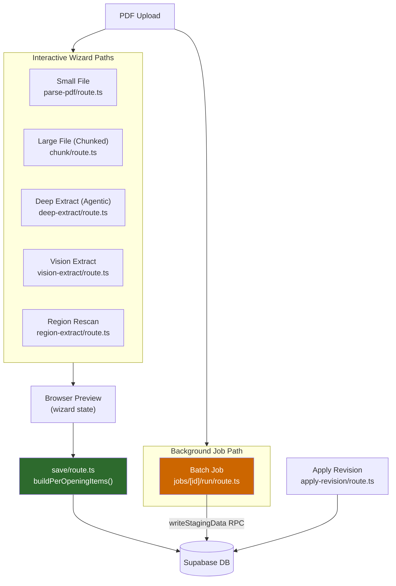
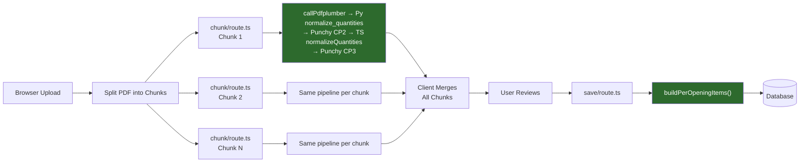
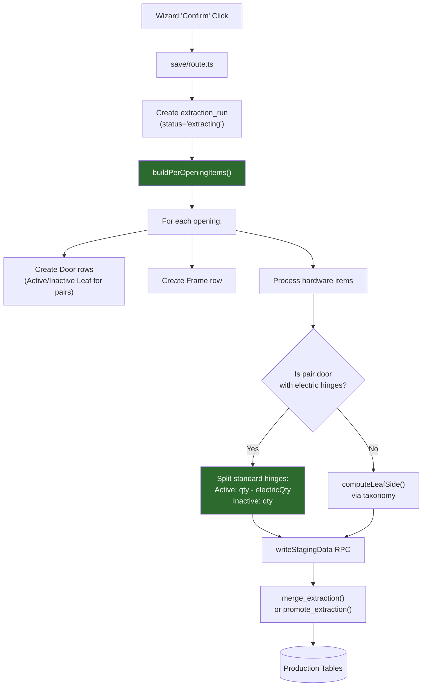
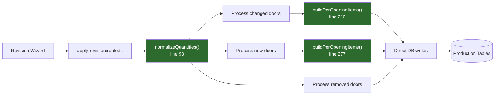
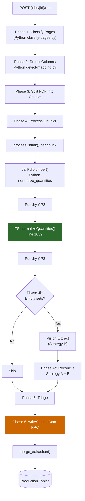
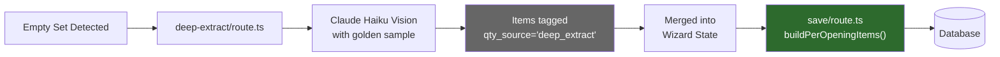
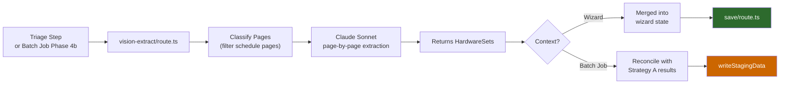
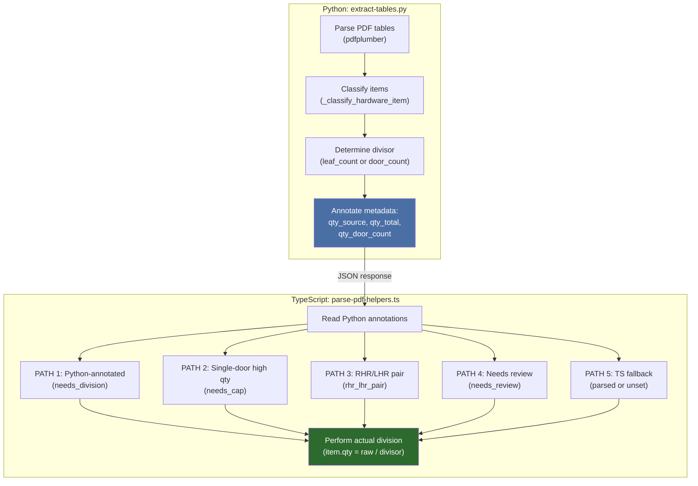

# Extraction Pipeline Architecture

This document maps every PDF processing path in the system, showing where quantity normalization, per-opening item building, and leaf-side attribution run — and where they don't.

## High-Level Overview

All extraction paths ultimately funnel data into two destinations: the **browser** (for wizard preview) or the **database** (via staging + promotion). The critical distinction is which normalization stages run in each path.

## Entry Points Summary

| # | Route | Purpose | Writes to DB? |
|---|-------|---------|:---:|
| 1 | `parse-pdf/route.ts` | Legacy/small file extraction | No |
| 2 | `parse-pdf/chunk/route.ts` | Chunked extraction (large files) | No |
| 3 | `parse-pdf/save/route.ts` | Wizard confirm — staging + promote | Yes |
| 4 | `parse-pdf/apply-revision/route.ts` | Revision re-extraction | Yes |
| 5 | `jobs/[id]/run/route.ts` | Background batch orchestrator | Yes |
| 6 | `parse-pdf/deep-extract/route.ts` | Agentic extraction (Claude vision for empty sets) | No |
| 7 | `parse-pdf/region-extract/route.ts` | User-drawn bbox region rescan | No |
| 8 | `parse-pdf/vision-extract/route.ts` | Full vision extraction (Claude Sonnet) | No |

Routes that don't write to DB return data to the browser wizard, which eventually saves via `save/route.ts`.

---

## Coverage Matrix

This matrix shows which normalization stages run in each extraction path. Green = runs. Red = missing. Gray = not applicable.

| Path | Python `normalize_quantities()` | TS `normalizeQuantities()` | `buildPerOpeningItems()` | `leaf_side` stamped |
|------|:---:|:---:|:---:|:---:|
| Small file (parse-pdf/route.ts) | YES | YES | -- | -- |
| Large file (chunk/route.ts) | YES | YES | -- | -- |
| Save (save/route.ts) | -- | -- | **YES** | **YES** |
| Apply revision (apply-revision/route.ts) | -- | YES | **YES** | **YES** |
| Batch job (jobs/[id]/run/route.ts) | YES | YES | **NO** | **NO** |
| Deep extract (deep-extract/route.ts) | -- | -- | -- | -- |
| Region rescan (region-extract/route.ts) | YES | -- | -- | -- |
| Vision extract (vision-extract/route.ts) | -- | -- | -- | -- |

**Key insight:** Interactive paths (1, 2) extract to the browser, then `save/route.ts` (3) handles `buildPerOpeningItems` + `leaf_side`. The batch job (5) bypasses `save/route.ts` entirely, writing directly via `writeStagingData` RPC.

---

## Path 1: Small File (Interactive Wizard)

The simplest extraction path. The entire PDF is processed in a single request.

```mermaid
flowchart LR
    A["Browser Upload"] --> B["parse-pdf/route.ts"]
    B --> C["callPdfplumber()"]
    C --> D["Python extract-tables.py<br/>normalize_quantities()"]
    D --> E["Punchy CP2<br/>(LLM column review)"]
    E --> F["TS normalizeQuantities()<br/>parse-pdf-helpers.ts:171"]
    F --> G["Punchy CP3<br/>(LLM qty check)"]
    G --> H["Return to Browser"]
    H --> I["User Reviews in Wizard"]
    I --> J["save/route.ts"]
    J --> K["buildPerOpeningItems()<br/>leaf_side stamped"]
    K --> L[(Database)]
    
    style D fill:#2d6a2d,color:#fff
    style F fill:#2d6a2d,color:#fff
    style K fill:#2d6a2d,color:#fff
```

**Coverage: COMPLETE.** Python annotates division hints. TS performs the actual division. `buildPerOpeningItems` creates per-leaf rows and stamps `leaf_side`. Electric hinge displacement logic fully covered.

**File references:**
- `src/app/api/parse-pdf/route.ts` — entry point
- `api/extract-tables.py:3885` — `normalize_quantities()` (Python annotation)
- `src/lib/parse-pdf-helpers.ts:171` — `normalizeQuantities()` call
- `src/app/api/parse-pdf/save/route.ts:164` — `buildPerOpeningItems()` call

---

## Path 2: Large File Chunked (Interactive Wizard)

For large PDFs, the file is split into chunks and each chunk is processed separately. The client merges results.

**Coverage: COMPLETE.** Each chunk runs the full Python + TS normalization. Merged results flow through `save/route.ts` for `buildPerOpeningItems`.

**File references:**
- `src/app/api/parse-pdf/chunk/route.ts:181` — `normalizeQuantities()` call per chunk

---

## Path 3: Save (Database Writer)

This is NOT an extraction path — it's the database writer that all interactive wizard paths funnel through. It's where `buildPerOpeningItems` runs.

**Important:** `normalizeQuantities()` intentionally does NOT run here. Items arrive already-divided from the extraction routes. Running it again would double-divide.

**File references:**
- `src/app/api/parse-pdf/save/route.ts:164` — `buildPerOpeningItems()` call
- `src/lib/parse-pdf-helpers.ts:2633` — `buildPerOpeningItems()` definition
- `src/lib/parse-pdf-helpers.ts:197` — `computeLeafSide()` definition

---

## Path 4: Apply Revision

Re-processes doors when the user changes door-to-hardware-set assignments, adds new doors, or removes doors.

**Coverage: COMPLETE.** `normalizeQuantities` runs before `buildPerOpeningItems`. `leaf_side` is stamped. Electric hinge logic fully covered.

**File references:**
- `src/app/api/parse-pdf/apply-revision/route.ts:93` — `normalizeQuantities()` call
- `src/app/api/parse-pdf/apply-revision/route.ts:210` — `buildPerOpeningItems()` for changed doors
- `src/app/api/parse-pdf/apply-revision/route.ts:277` — `buildPerOpeningItems()` for new doors

---

## Path 5: Background Batch Job (KNOWN GAP)

The batch job orchestrator processes large PDFs in the background. It has the most complex pipeline but **bypasses `buildPerOpeningItems`**.

### What's Missing

The batch job writes items via `writeStagingData()` RPC (lines 898-914 of `jobs/[id]/run/route.ts`), which maps hardware set items directly — **without calling `buildPerOpeningItems()`**.

This means batch-processed projects are missing:

| Feature | Wizard Path | Batch Job Path |
|---------|:-----------:|:--------------:|
| Door/Frame structural rows | YES | **NO** |
| `leaf_side` stamped | YES | **NO** |
| Per-leaf hinge split (electric displaces standard) | YES | **NO** |
| `normalizeQuantities()` quantity division | YES | YES |

**Impact:** Production data from batch jobs has lower fidelity than wizard-imported data. The UI's `classify-leaf-items.ts` has fallback logic for NULL `leaf_side`, so rendering won't break — but quantities on pair doors with electric hinges will be wrong.

**File references:**
- `src/app/api/jobs/[id]/run/route.ts:1059` — `normalizeQuantities()` in `processChunk()`
- `src/app/api/jobs/[id]/run/route.ts:898-914` — staging payload construction (no `buildPerOpeningItems`)

---

## Path 6: Deep Extraction (Agentic)

Used for hardware sets that initial extraction returned empty. Claude Haiku vision reads the PDF region and extracts items directly.

**Coverage: ACCEPTABLE.** Items get `qty_source='deep_extract'` which is in the `NEVER_RENORMALIZE` set — `normalizeQuantities()` skips them even if it runs later. The LLM returns per-opening quantities directly. Items flow through `buildPerOpeningItems()` at save time, so `leaf_side` IS stamped.

**File references:**
- `src/app/api/parse-pdf/deep-extract/route.ts` — entry point
- `src/lib/parse-pdf-helpers.ts:156` — `NEVER_RENORMALIZE` set includes `'deep_extract'`

---

## Path 7: Region Rescan

User draws a bounding box on a rendered PDF page to re-extract a specific area.

```mermaid
flowchart LR
    A["User Draws Bbox<br/>on PDF Page"] --> B["region-extract/route.ts"]
    B --> C["Python extract-tables.py<br/>pdfplumber.crop(bbox)"]
    C --> D["Python normalize_quantities()<br/>annotates items"]
    D --> E["Route OVERWRITES<br/>qty_source → 'region_extract'"]
    E --> F["Return to Browser"]
    F --> G["Replaces set items<br/>in wizard state"]
    G --> H["save/route.ts<br/>buildPerOpeningItems()"]
    H --> I[(Database)]

    style E fill:#cc6600,color:#fff
    style H fill:#2d6a2d,color:#fff
```

**Coverage: ACCEPTABLE with caveat.** Python's division annotations (`needs_division`, `parsed`) are discarded when region-extract overwrites `qty_source` to `'region_extract'` (line 121). Since `'region_extract'` is in `NEVER_RENORMALIZE`, items will never be divided even if their quantities are aggregates. Mitigated by the fact that region rescans target small specific areas.

**File references:**
- `src/app/api/parse-pdf/region-extract/route.ts:121` — `qty_source` overwrite
- `src/lib/parse-pdf-helpers.ts:157` — `NEVER_RENORMALIZE` includes `'region_extract'`

---

## Path 8: Vision Extraction

Full-page Claude Sonnet extraction, used as "Strategy B" in batch job reconciliation or from the wizard triage step.

**Coverage: ACCEPTABLE.** In the wizard path, items flow through `save/route.ts` and `buildPerOpeningItems`. In the batch job path, they merge with Strategy A results in reconciliation but still bypass `buildPerOpeningItems` (same batch job gap).

---

## Python-to-TypeScript Normalization Relationship

The quantity normalization is deliberately split across two languages:

**Why the split?**
- **Python** has the best heading/block context (door counts, leaf counts from the PDF structure)
- **TypeScript** has the hardware taxonomy (per_leaf, per_opening, per_pair, per_frame scopes)
- Python annotates *how* to divide; TypeScript performs the division
- Neither alone has complete information

**File references:**
- `api/extract-tables.py:3885-4208` — Python `normalize_quantities()`
- `src/lib/parse-pdf-helpers.ts:1635-2016` — TS `normalizeQuantities()`

---

## NEVER_RENORMALIZE Guard

Items with certain `qty_source` values are protected from double-division. The `NEVER_RENORMALIZE` set (`parse-pdf-helpers.ts:155-158`) includes:

| qty_source | Set by | Meaning |
|------------|--------|---------|
| `'divided'` | `normalizeQuantities()` | Already divided — don't re-divide |
| `'capped'` | `normalizeQuantities()` | Already capped at category max |
| `'user_override'` | UI | User manually set the quantity |
| `'deep_extract'` | `deep-extract/route.ts` | LLM returned per-opening qty directly |
| `'region_extract'` | `region-extract/route.ts` | User-scanned region, assume per-opening |
| `'rhr_lhr_pair'` | `normalizeQuantities()` | RHR/LHR pair → qty=1 |

This guard is essential for preventing quantity corruption when items pass through multiple pipeline stages.
