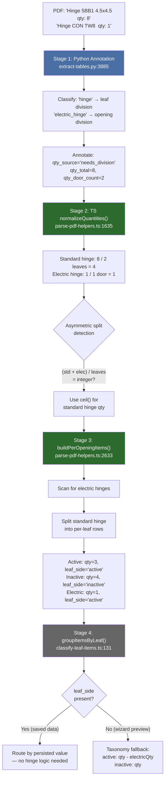
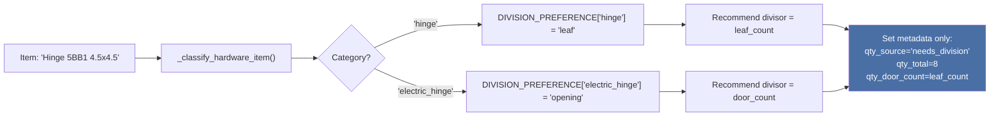
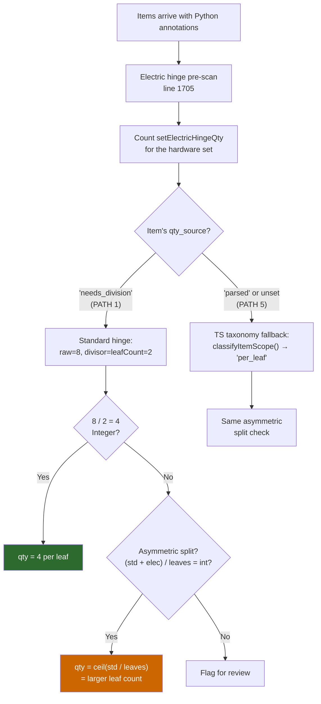
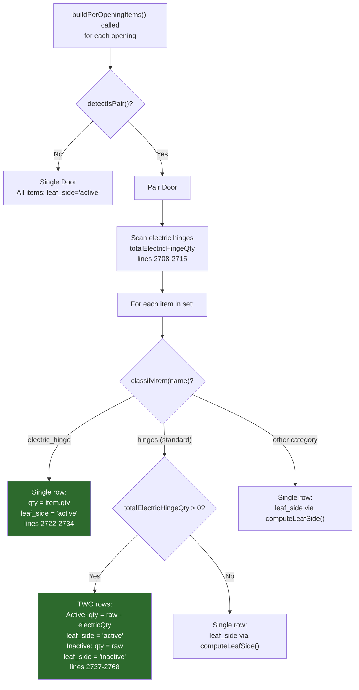
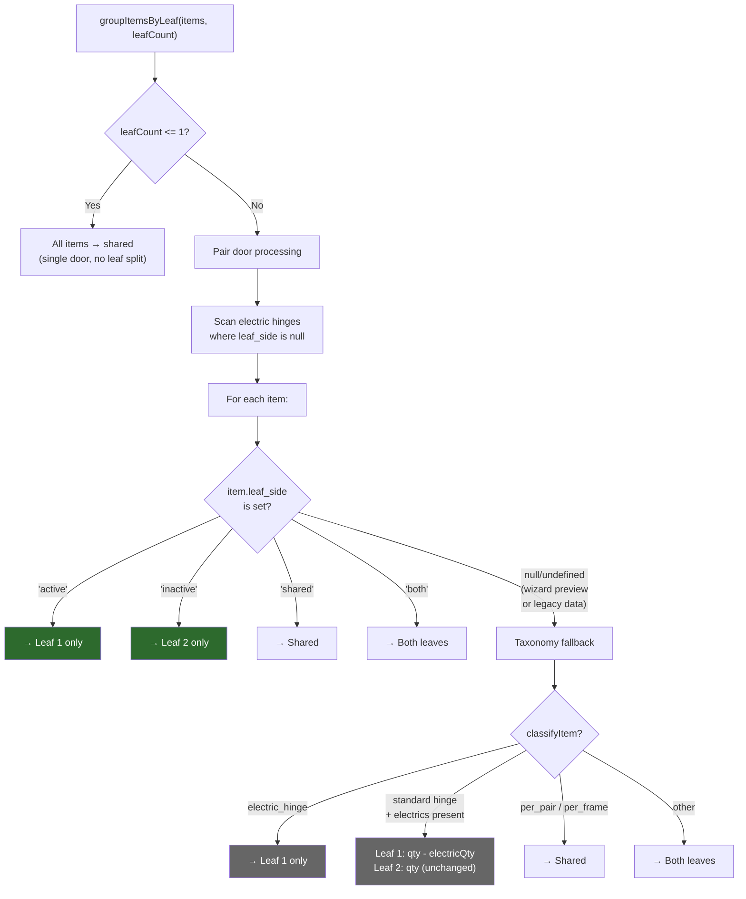
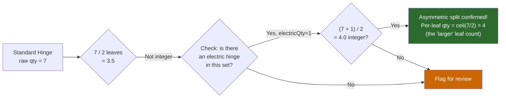
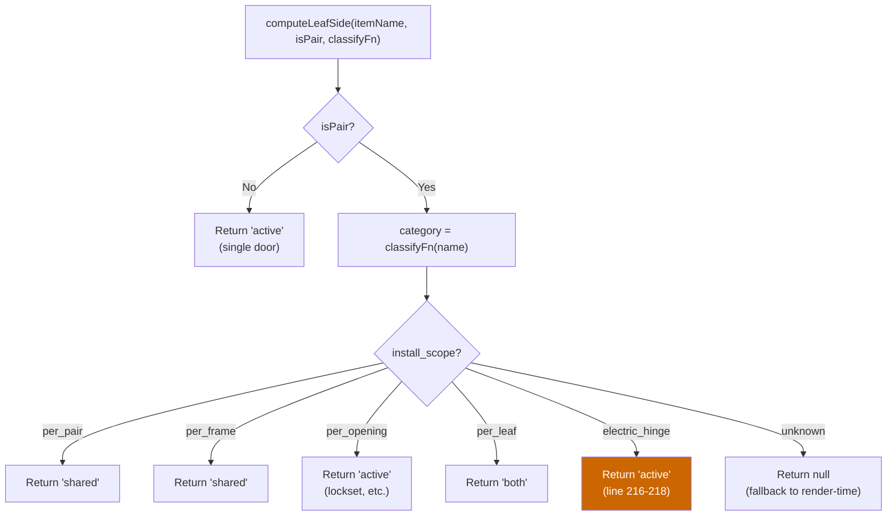
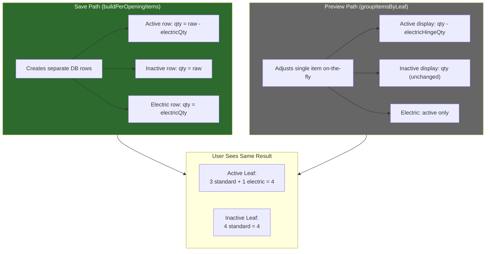

# Hinge Quantity Pipeline

This document details the hinge-specific logic in the extraction pipeline. The core complexity is the **"electric hinge displaces standard hinge"** rule for pair doors, which is implemented across multiple pipeline stages.

## The Rule

On pair doors, each leaf gets its own set of hinges. When an electric (electrified/conductor) hinge is present, it physically replaces one standard hinge position on the **active leaf** only. The inactive leaf keeps its full standard hinge count.

**Example:** A pair door with 4 standard hinges and 1 electric hinge per opening:
- **Active leaf:** 3 standard + 1 electric = 4 total hinge positions
- **Inactive leaf:** 4 standard + 0 electric = 4 total hinge positions

This rule affects three pipeline stages: quantity division, per-opening item building, and render-time leaf grouping.

---

## Pipeline Overview

---

## Stage-by-Stage Detail

### Stage 1: Python Annotation

Python classifies items and recommends a division strategy but does **not** mutate quantities or handle the electric-displaces-standard rule.

**File:** `api/extract-tables.py:3885-4208`

Python has **no knowledge** of the electric-displaces-standard relationship. It simply recommends different divisors for standard vs electric hinges.

### Stage 2: TS Quantity Division

TypeScript's `normalizeQuantities()` performs the actual division and detects asymmetric hinge splits.

**The asymmetric split detection** handles cases like: 7 standard + 2 electric = 9 total. 9 / 2 leaves = 4.5 (not integer), but `(7 + 2) / 2 = 4.5` — wait, that's not integer either. The real scenario: 7 standard hinges across 2 leaves where one leaf has an electric hinge. `7 / 2 = 3.5` (not integer), but `(7 + 1) / 2 = 4` (integer!). So: active leaf = ceil(7/2) = 4 standard, inactive leaf = 4 standard. The electric hinge (qty=1) displaces one position on active.

**This logic is duplicated** between PATH 1 (lines 1758-1772) and PATH 5 (lines 1900-1916) — identical asymmetric split check in both code paths.

**File:** `src/lib/parse-pdf-helpers.ts:1635-2016`

### Stage 3: Per-Opening Item Builder (Save Path)

`buildPerOpeningItems()` creates the actual database rows, splitting standard hinges into separate active/inactive rows when electric hinges are present.

**File:** `src/lib/parse-pdf-helpers.ts:2633-2786`

### Stage 4: Render-Time Leaf Grouping

`groupItemsByLeaf()` groups items into Shared / Leaf 1 (Active) / Leaf 2 (Inactive) for display. It serves **two distinct contexts** and must handle both.

**The two contexts:**
- **Saved data** (items have `leaf_side`): The persisted-value path handles everything. No hinge math needed — `buildPerOpeningItems` already split the rows.
- **Wizard preview** (items have NO `leaf_side`): The taxonomy fallback path re-implements the electric-displaces-standard rule for on-the-fly display. Items are NOT yet split into per-leaf rows, so the adjustment happens here.

**File:** `src/lib/classify-leaf-items.ts:131-226`

---

## Coverage Per Extraction Path

| Path | Division Adjustment (normalizeQuantities) | Per-Leaf Split (buildPerOpeningItems) | Render Fallback (groupItemsByLeaf) |
|------|:---:|:---:|:---:|
| Wizard (small/large) | YES | YES (at save) | Preview only |
| Batch job | YES | **NO** | Fallback needed |
| Apply revision | YES | YES | Not needed |
| Deep extract | N/A (LLM-determined) | YES (at save) | Preview only |
| Region rescan | N/A (terminal qty_source) | YES (at save) | Preview only |

The batch job gap means items promoted from batch jobs have no `leaf_side` and no per-leaf hinge split. The display falls back to `groupItemsByLeaf` taxonomy logic, which works for unsplit data but produces wrong results if data was later re-imported with `buildPerOpeningItems` creating split rows.

---

## The Four Classification Systems

Hinge identification depends on regex classification. There are **four independent classifiers** that must agree on what constitutes a "hinge" vs "electric_hinge":

### Known Divergences

| Issue | Python | TypeScript |
|-------|--------|------------|
| Category ID for standard hinges | `"hinge"` (singular) | `"hinges"` (plural) |
| Spring hinge category | Falls through to `"hinge"` | Separate `"spring_hinge"` category |
| Check order: continuous vs electric | `continuous_hinge` checked **before** `electric_hinge` | `electric_hinge` checked **first** |
| Pivot hinge category ID | `"pivot"` | `"pivot_hinge"` |
| Regex pattern scope | Broader (e.g., `"hinge"` catches pivots) | More specific (separate patterns) |

These divergences rarely cause bugs because:
1. Python only recommends a divisor — it doesn't make leaf-attribution decisions
2. TS re-classifies every item independently
3. The critical "is this an electric hinge?" check agrees in both systems

But edge cases (e.g., a name matching both `continuous_hinge` and `electric_hinge` patterns) could classify differently due to check ordering.

---

## Asymmetric Split Detection

When the PDF shows an odd total that doesn't divide evenly by leaf count, the pipeline checks whether electric hinges explain the asymmetry.

**Why ceil?** The inactive leaf gets the full standard count (4), and the active leaf gets the remainder after electric displacement (4 - 1 = 3 standard + 1 electric = 4 total). Using `ceil()` during division gives us the inactive leaf's count, which is the "undisplaced" value.

**File references:**
- `src/lib/parse-pdf-helpers.ts:1758-1772` — PATH 1 asymmetric check
- `src/lib/parse-pdf-helpers.ts:1900-1916` — PATH 5 asymmetric check (duplicate)

---

## `computeLeafSide()` Logic

Determines `leaf_side` for items that aren't special-cased by `buildPerOpeningItems`. Electric hinges are handled here but **overridden** by `buildPerOpeningItems` — a belt-and-suspenders guard.

**Note:** The `electric_hinge → 'active'` return at line 216-218 is immediately overridden by `buildPerOpeningItems` which has its own electric hinge handling. This is intentional redundancy.

**File:** `src/lib/parse-pdf-helpers.ts:197-222`

---

## Save Path vs Preview Path

The electric-displaces-standard rule is implemented in **two places** that must produce equivalent results:

**These are NOT consolidatable today** because the save path creates physical row splits while the preview path operates on unsaved items. They encode the same business rule independently — a potential source of future divergence.
