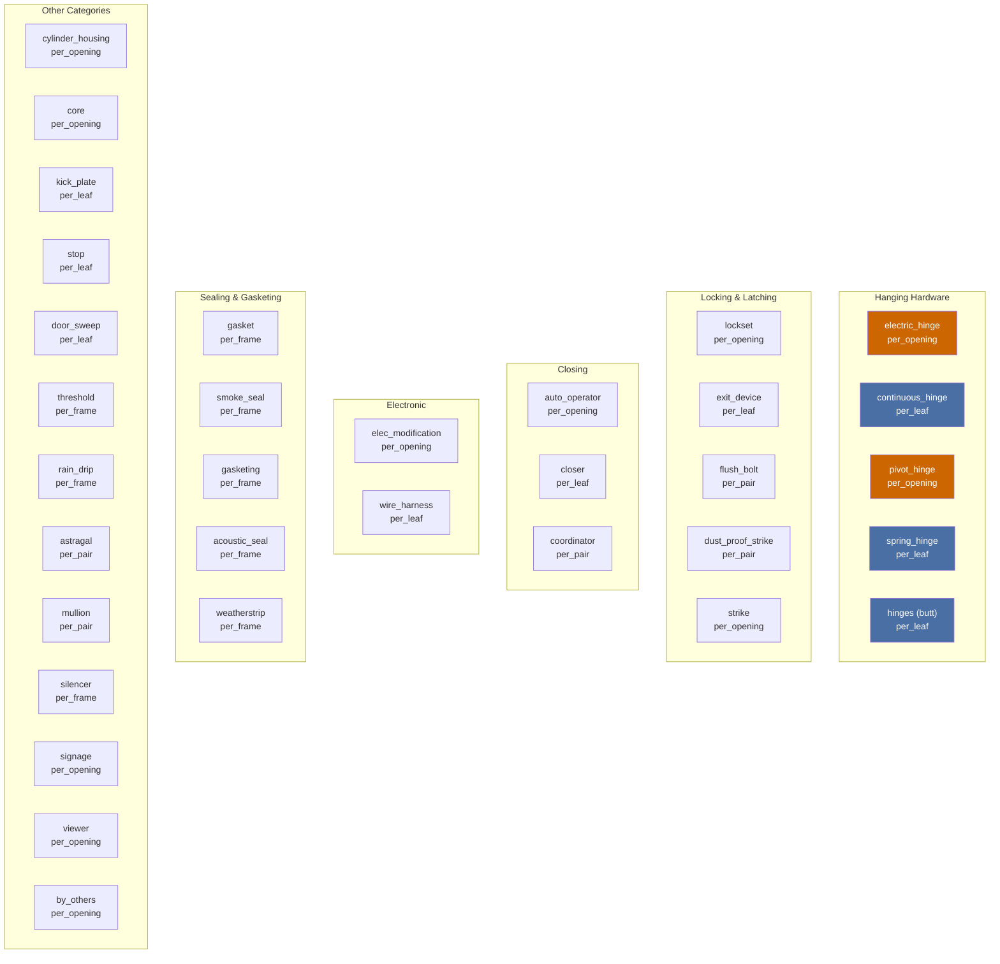
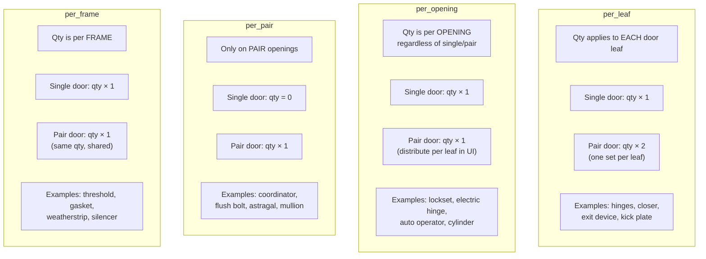
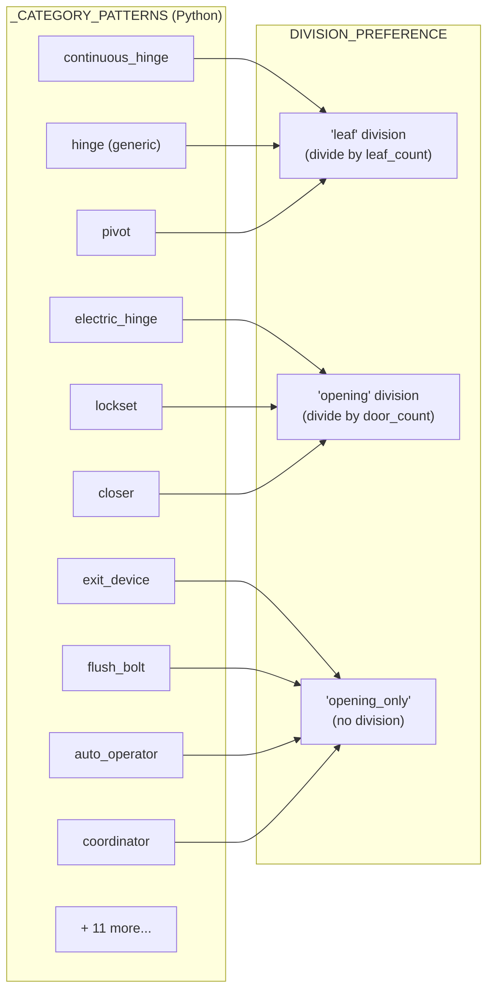
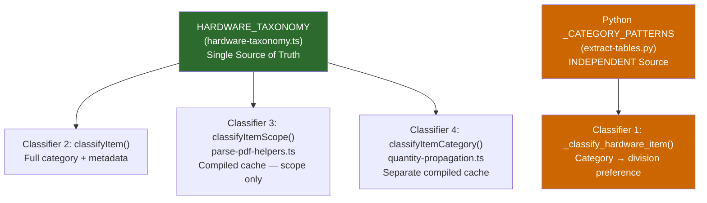
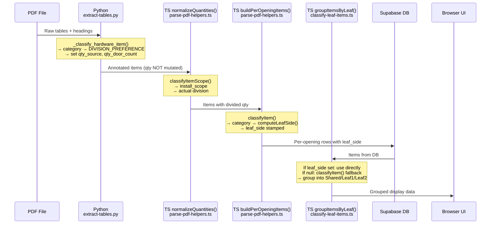

# Hardware Classification System

This document describes the hardware taxonomy — the classification system that determines how items are categorized, how quantities scale across door types, and where the known divergences between Python and TypeScript classifiers exist.

## Overview

The classification system answers two questions for every hardware item:
1. **What category is it?** (hinge, lockset, closer, etc.)
2. **How does its quantity scale?** (per leaf, per opening, per pair, per frame)

These answers drive quantity division, leaf attribution, and pair-door display logic throughout the pipeline.

---

## HARDWARE_TAXONOMY (TypeScript Source of Truth)

Defined in `src/lib/hardware-taxonomy.ts:47-678`. Each category has:

```typescript
interface HardwareCategory {
  id: string                           // Unique category ID
  label: string                        // Display name
  name_patterns: string[]              // Regex patterns (case-insensitive)
  universal: boolean                   // Expected on every opening?
  exterior: boolean                    // Expected on exterior?
  interior: boolean                    // Expected on interior?
  fire_rated: boolean                  // Expected on fire-rated?
  pairs_only: boolean                  // Only relevant for pairs?
  install_scope: InstallScope          // How quantities scale
  typical_qty_single: [number, number] // Min/max qty for singles
  typical_qty_pair: [number, number]   // Min/max qty for pairs
}
```

### Category Listing



**Color key:** Orange = `per_opening`, Blue = `per_leaf`

---

## Install Scope Values

The `install_scope` determines how a category's quantity scales with door configuration:



### Impact on Pipeline

| Install Scope | Python Division Strategy | `normalizeQuantities()` Divisor | `buildPerOpeningItems()` | `groupItemsByLeaf()` |
|---------------|------------------------|---------------------------------|--------------------------|---------------------|
| `per_leaf` | `"leaf"` → divide by leaf_count | Uses leaf_count | Per-leaf row with `computeLeafSide()` | Both leaves |
| `per_opening` | `"opening"` → divide by door_count | Uses door_count | Single row, `leaf_side='active'` | Active leaf only |
| `per_pair` | `"opening_only"` → no division | No division | Single row, `leaf_side='shared'` | Shared section |
| `per_frame` | `"opening_only"` → no division | No division | Single row, `leaf_side='shared'` | Shared section |

---

## Python Classification: _CATEGORY_PATTERNS

Defined in `api/extract-tables.py:218-252`. Python maintains its own independent regex list with different category names.

### Python's Categories and Division Preferences



**File:** `api/extract-tables.py:192-260`

### DIVISION_PREFERENCE mapping

| Division Strategy | Python Categories |
|-------------------|-------------------|
| `"leaf"` | hinge, wire_harness, continuous_hinge, pivot, exit_device, stop, kick_plate, sweep |
| `"opening"` | electric_hinge, auto_operator, closer, lockset, holder, cylinder, strike, pull, silencer |
| `"opening_only"` | threshold, astragal, seal, coordinator, flush_bolt |

---

## The Four Regex Classifiers

The system has four independent regex classification systems. All must agree for consistent behavior.

### Classifier 1: Python `_CATEGORY_PATTERNS`

**File:** `api/extract-tables.py:218-252`
**Used by:** `_classify_hardware_item()` (line 255)
**Purpose:** Determines division strategy (leaf vs opening vs opening_only)
**Called from:** `normalize_quantities()` — Python annotation phase

```
Pattern examples:
  continuous_hinge: r"(?i)\bcontinuous\s*hinge"
  electric_hinge:   r"(?i)\belectric.*hinge|hinge.*electric|conductor.*hinge|hinge.*\bCON\b|hinge.*\bTW\d|power\s*transfer"
  hinge (generic):  r"(?i)\bhinge|pivot|spring\s*hinge"
```

### Classifier 2: TypeScript `HARDWARE_TAXONOMY`

**File:** `src/lib/hardware-taxonomy.ts:47-678`
**Used by:** `classifyItem()` — primary TS classifier
**Purpose:** Maps item names to categories with full metadata (install_scope, typical quantities, etc.)
**Called from:** `buildPerOpeningItems()`, `groupItemsByLeaf()`, `normalizeQuantities()`, UI components

```
Pattern examples (electric_hinge):
  "hinge.*\\bCON\\b"
  "hinge.*\\bTW\\d"
  "hinge.*electr"
  "electr.*hinge"
  "conductor.*hinge"
  "power\\s*transfer\\s*hinge"
```

### Classifier 3: TS `_taxonomyRegexCache` (parse-pdf-helpers.ts)

**File:** `src/lib/parse-pdf-helpers.ts:107-112`
**Used by:** `classifyItemScope()` (line 119)
**Purpose:** Quick scope lookup (per_leaf, per_opening, etc.) during quantity normalization
**Called from:** `normalizeQuantities()` PATH 5 (TS fallback)

This is a **compiled cache** of `HARDWARE_TAXONOMY` regex patterns. Same source data as Classifier 2 — no divergence risk.

### Classifier 4: TS `_taxonomyRegexCache` (quantity-propagation.ts)

**File:** `src/lib/quantity-propagation.ts:18-33`
**Used by:** `classifyItemCategory()` (line 24)
**Purpose:** Category lookup for quantity propagation across sets
**Called from:** `propagateQuantityDecision()` (line 68)

This is a **separate compiled copy** of the same `HARDWARE_TAXONOMY` regex patterns. Same source data — but a duplicated cache. Could be consolidated into a shared export from `hardware-taxonomy.ts`.

### Classifier Comparison



---

## Known Divergences Between Python and TypeScript

### Category ID Mismatches

| Item Type | Python Category | TypeScript Category | Impact |
|-----------|----------------|---------------------|--------|
| Standard hinge | `"hinge"` | `"hinges"` | IDs don't match in string comparisons |
| Pivot hinge | `"pivot"` | `"pivot_hinge"` | IDs don't match |
| Spring hinge | Falls through to `"hinge"` | `"spring_hinge"` (separate) | Different categorization |

These ID mismatches don't cause bugs today because Python and TypeScript never compare category IDs across the boundary — they each classify independently and act on their own results. But it prevents future consolidation.

### Regex Pattern Differences

| Pattern | Python | TypeScript |
|---------|--------|------------|
| Generic hinge | `r"(?i)\bhinge\|pivot\|spring\s*hinge"` — catches pivots AND springs | Separate patterns for `pivot_hinge`, `spring_hinge`, `hinges` |
| Check order | `continuous_hinge` **before** `electric_hinge` | `electric_hinge` **before** `continuous_hinge` |
| Pivot | Captured by generic `"hinge"` pattern | Separate `"pivot_hinge"` category |

### Check Order Risk

Python checks `continuous_hinge` before `electric_hinge`. TypeScript checks `electric_hinge` first. If an item name matches both patterns (e.g., "Continuous Electric Hinge" — unlikely but possible), they would classify differently:
- Python: `continuous_hinge` → `leaf` division → divide by leaf_count
- TypeScript: `electric_hinge` → `per_opening` scope → divide by door_count

### Division Strategy Differences

| Category | Python Division | TS Install Scope | Agreement? |
|----------|-----------------|-----------------|:---:|
| Standard hinges | `"leaf"` → leaf_count | `per_leaf` | YES |
| Electric hinges | `"opening"` → door_count | `per_opening` | YES |
| Continuous hinges | `"leaf"` → leaf_count | `per_leaf` | YES |
| Closers | `"opening"` → door_count | `per_leaf` | **NO** |
| Exit devices | `"leaf"` → leaf_count | `per_leaf` | YES |
| Stop/holder | `"opening"` (holder) | `per_leaf` (stop) | **MAYBE** |

**Closer divergence:** Python classifies closers as `"opening"` division (divide by door_count), but TypeScript classifies them as `per_leaf` (divide by leaf_count). For single doors, this doesn't matter (door_count = leaf_count = 1). For pair doors, it would mean Python recommends dividing by 1 (door_count for a pair = 1 if the set covers one opening) while TypeScript recommends dividing by 2 (leaf_count = 2). In practice, this is resolved by `normalizeQuantities()` which trusts Python's divisor in PATH 1 but uses TS scope in PATH 5.

---

## `getTaxonomyForPython()` Export

TypeScript already exports the taxonomy for Python consumption:

**File:** `src/lib/hardware-taxonomy.ts:828-838`

This function generates a JSON representation of `HARDWARE_TAXONOMY` for the Python `extract-tables.py` endpoint. However, Python does NOT currently use this export — it maintains its own independent `_CATEGORY_PATTERNS`.

**Recommended consolidation:** Have Python load the taxonomy JSON at startup and derive `DIVISION_PREFERENCE` from `install_scope`, eliminating the independent Python classifier entirely. See the [Hinge Logic simplification recommendations](./hinge-logic.md#the-four-classification-systems).

---

## How Classification Flows Through the Pipeline



---

## Taxonomy Maintenance Checklist

When adding a new hardware category or modifying patterns:

1. **Update `HARDWARE_TAXONOMY`** in `src/lib/hardware-taxonomy.ts` — this is the TypeScript source of truth
2. **Update `_CATEGORY_PATTERNS`** in `api/extract-tables.py` — Python's independent list (until consolidation)
3. **Update `DIVISION_PREFERENCE`** in `api/extract-tables.py` — Python's division strategy mapping
4. **Verify regex ordering** — specific patterns must precede generic catch-alls in both systems
5. **Check `install_scope` consistency** — the new category's scope must align with the Python division preference
6. **Test with `normalizeQuantities()`** — ensure PATH 1 (Python-annotated) and PATH 5 (TS fallback) produce the same result for the new category
